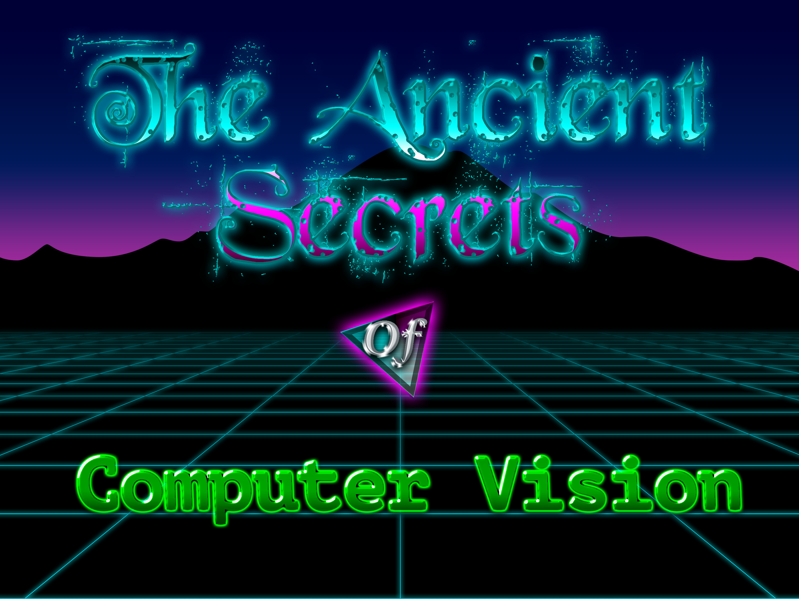

# CSE 455 Homework Solution

---

- [x] [**Homework 0: Fun with color!**](./vision-hw0/README.md)
- [x] [**Homework 1: Resizing and convolutions**](./vision-hw1/README.md)
- [ ] [**Homework 2: Panoramas!**](./vision-hw2/README.md)
- [ ] [**Homework 3: Optical Flow**](./vision-hw3/README.md)
- [ ] [**Homework 4: Neural Networks and Machine Learning**](./vision-hw4/README.md)
- [ ] [**Homework 5: PyTorch**](./vision-hw5/README.md)

---

[The Ancient Secrets of Computer Vision - University of Washington, Spring 2018](https://courses.cs.washington.edu/courses/cse455/18sp/)

